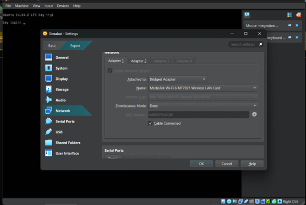
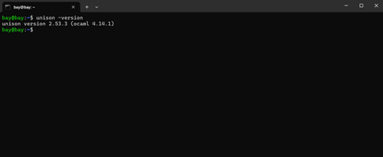
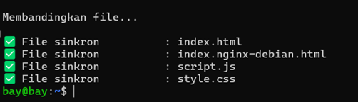

# Konfigurasi dan laporan Tugas Sistem Terdistribusi UAS

## Perancangan Sinkronisasi Dengan Unison dan Pengujian Sistem Failover Berbasis Ubuntu Server Untuk Layanan Web

Kami membuat konfigurasi untuk mengatur ubuntu server agar dapat menangani permmintaan dengan sistem failover. serta dapat menangani perubahan disetiap server secara otomatis

Tools yang kami pakai

- Ubuntu server 24.04.02 (sebagai virtual device)
- keepalived (sebagai penanganan failover)
- Unison (sebagai penanganan sinkronisasi file antar server di suatu direktori)
- nginx (sebagai web server)

### Langkah - langkah

### Konfigurasi Failover

1. langkah pertama setelah berhasil instalasi virtual box dan membuat virtual device ubuntu server 24.04.02. mengkonfigurasi setelan jaringan pada virtual box
   
   pastikan network yang dipilih pada adapter 1 Bridged Adapter lalu pada adapter 2 NAT
2. lalu jalankan virtual device [start] setelah berhasil membuat profil seperti username dan password untuk login selanjutnya menginstall semua kebutuhan tools pada virtual device [pastikan perangkat terhubung ke internet]
3. lakukan konfigurasi ip [sudo /etc/netplan/*.yaml]
4. install juga open ssh agar antar device bisa saling terhubung
   - sudo apt update
   - sudo apt install openssh-server openssh-client
5. setelah semua kebutuhan siap selanjutnya
   - /etc/keepalived/keepalived.conf [untuk mengatur failover ]
   - vrrp_instance VI_1 {
     state MASTER
     interface enp0s3 # ganti dengan nama interface kamu
     virtual_router_id 51
     priority 100 # atur priority tertinggi untuk menjadikan device tersebut sebagai master maks 255
     advert_int 1
     authentication {
     auth_type # atur auth dan pass sesuai keinginan
     auth_pass
     }
     virtual_ipaddress { # atur ip address kamu disini yang kamu gunakan untuk akses web browser
     }
     }
6. install terlebih dahulu nginx [sudo apt install nginx -y] untuk mengaktifkan layanan web server
   - jalankan [sudo systemctl status nginx] untuk mengecek status web server sudah aktif belum
   - lalu sbuat file html untuk menampilkan isi web browser
     jalankan sudo mkdir /var/www/html lalu
     [echo "INI NODE1" | sudo tee /var/www/html/index.html] untuk membuat direktori sekaligus file html sederhana
     buat file baru [sudo nano style.css dan sudo nano script.js] style.css dan script.js sebagai pendukung tampilan
     ubah isi ketiga file tersebut dengan sudo nano index.html/style.css/script.js pastikan terminal anda sudah ada di direktori file tersebut berada!!!
7. Cek status failover. jalankan [ip a | grep #isikan bagian ini dengan virtual ip yang dikonfigurasi pada keepalived.conf diatas]
8. Jalankan domain yang http://192.168.56.1 #ip disesuaikan dengan konfigurasi keepalived.conf

### Konfigurasi Unison

1. install unison [sudo apt update] lalu [sudo apt install unison -y] jika sudah diinstall diawal
   langsung saja jalankan unison -version unuk melihat apakah unison telah terinstall
   
2. selanjutnya konfigurasi setup ssh target

- jalankan [1. ssh-keygen -t rsa] dan [ssh-copy-id user@node2] #isi user dan node2 dengan nama device server dan ipnya
  setelah berhasil coba test login [ssh user@node2] #sesuaikan dengan device

3.        jalankan nano ~/.unison/html-sync.prf
        isi dengan :
    root = /var/www/html
    root = ssh://user@node 2//var/www/html
    //ubah user@node2 dengan profil yang dimiliki di device 2 user device dan ipnya

auto = true
batch = true
prefer = /var/www/html 4. Jalankan unison html-sync untuk pengujian 5. Untuk menkonfigurasi unison agar dapat berjalan otomatis setiap ada perubahan
install inotify dengan menjalankan [ sudo apt install inotify-tools -y ] 6. setelah berhasil install inotify jalankan [nano ~/unison-sync.sh ] isikan dengan skrip berikut
[
#!/bin/bash # Skrip untuk memantau perubahan di folder /var/www/html
inotifywait -m /var/www/html -e modify,create,delete |
while read path action file; do
echo "Perubahan terdeteksi: $action pada $file"
/usr/bin/unison html-sync
done

    ]

7. simpan lalu berikan izin eksekusi, jalankan [chmod +x ~/unison-sync.sh]
8. Selanjutnya Jalankan [nohup ~/unison-sync.sh &] untuk mengaktifkan sinkronisasi unison secara otomatis. Ubah kembali isi dari file index.html dan cek perubahannya [./monitor-folder-sync.sh]
   
